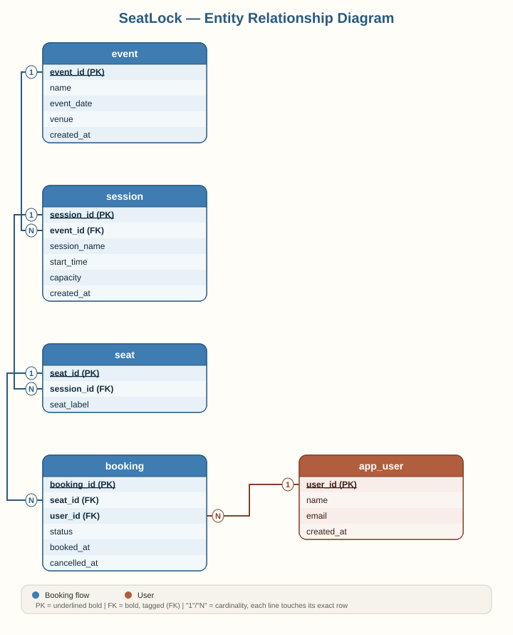

# SeatLock

A PostgreSQL project demonstrating concurrency-safe booking logic for limited-capacity events — proving, not just claiming, that simultaneous booking requests for the same seat can't result in a double-booking.

## Entity Relationship Diagram



*PK = underlined bold · FK = bold, tagged (FK) · "1"/"N" mark each relationship's cardinality.*

## Schema overview

| Table | Purpose |
|---|---|
| `app_user` | People who can book seats (named `app_user` — `user` is a reserved word in PostgreSQL) |
| `event` | Events (e.g. a conference) |
| `session` | Time-slotted sessions within an event, each with a seat capacity |
| `seat` | Individual seats belonging to a session |
| `booking` | Confirmed/cancelled bookings, linking a seat to a user |

The core guarantee is enforced by a **partial unique index**:

```sql
CREATE UNIQUE INDEX idx_one_confirmed_booking_per_seat
ON booking (seat_id)
WHERE status = 'Confirmed';
```

A seat can have any number of *cancelled* bookings in its history, but only ever one *confirmed* booking at a time — enforced at the database level, not just in application code.

## What this project demonstrates

- **Row-level locking** (`SELECT ... FOR UPDATE`) to serialize concurrent access to the same seat
- **A real concurrency bug, found and fixed during testing** (see below) — not a contrived example
- **Partial unique constraints** as a database-level safety net independent of application logic
- **Cancellation logic** that correctly frees a seat back up for rebooking
- **A Python script proving correctness under real concurrent load**, not just describing it
- **An interactive CLI**, so the project can be tried by anyone — technical or not — without writing SQL or code

## The bug I found (and why it's in the repo)

`sql/02_booking_logic.sql` is the **original** version of `book_seat()`. It locks the seat's *existing confirmed booking row* before checking availability:

```sql
SELECT b.booking_id INTO v_existing_booking_id
FROM booking b
WHERE b.seat_id = p_seat_id AND b.status = 'Confirmed'
FOR UPDATE;
```

This looks correct, and it *is* correct — once a seat has at least one prior booking. But `FOR UPDATE` only locks rows that exist. On a seat with **zero** prior bookings, there is nothing to lock, so concurrent transactions could all pass the "is it free?" check at the same instant and race to insert. Running the concurrency simulation against a fresh, never-booked seat exposed this immediately:

```
[SUCCESS] Devon Ashby     -> Booking confirmed (booking_id=22)
[blocked] Jordan Blake    -> ERROR: duplicate key value violates unique constraint "idx_one_confirmed_booking_per_seat"
[blocked] Priya Anand     -> ERROR: duplicate key value violates unique constraint "idx_one_confirmed_booking_per_seat"
[blocked] Sana Malik      -> ERROR: duplicate key value violates unique constraint "idx_one_confirmed_booking_per_seat"
[blocked] Ahmed Raza      -> ERROR: duplicate key value violates unique constraint "idx_one_confirmed_booking_per_seat"

1 succeeded, 4 correctly blocked.
```

No double-booking occurred — the partial unique index caught it as a fallback — but the *intended* locking mechanism wasn't the thing that actually prevented it, and the failure surfaced as a raw database error instead of a clean, handled response.

**The fix**, in `sql/03_booking_logic_fixed.sql`: lock the **seat row** instead of the booking row. A seat row always exists once seeded, regardless of booking history, so `FOR UPDATE` always has something real to serialize on:

```sql
PERFORM 1 FROM seat WHERE seat_id = p_seat_id FOR UPDATE;
```

Re-running the same simulation against a fresh seat after the fix:

```
[SUCCESS] Jordan Blake    -> Booking confirmed (booking_id=24)
[blocked] Priya Anand     -> Seat already booked (booking_id=24)
[blocked] Ahmed Raza      -> Seat already booked (booking_id=24)
[blocked] Sana Malik      -> Seat already booked (booking_id=24)
[blocked] Devon Ashby     -> Seat already booked (booking_id=24)

1 succeeded, 4 correctly blocked.
PASS: exactly one booking succeeded, as expected under correct locking.
```

Both files are kept in the repo intentionally, as a record of the debugging process rather than a polished result presented as if it worked the first time.

## Setup

1. Create a database (e.g. `seatlock`) in PostgreSQL.
2. Run the SQL files **in order**:

```
sql/00_schema.sql                  -- table definitions + partial unique index
sql/01_seed_data.sql               -- 10 users, 2 events, 4 sessions, 29 seats
sql/02_booking_logic.sql           -- original book_seat() -- kept for the debugging record
sql/03_booking_logic_fixed.sql     -- corrected book_seat() -- this is the version actually in effect
```

> `03` uses `CREATE OR REPLACE FUNCTION`, so running it after `02` overwrites the buggy version with the fixed one. The final, active version of `book_seat()` is always whichever ran most recently.

3. Install Python dependencies:

```bash
pip install psycopg2-binary
```

4. Edit `DB_CONFIG` in both `scripts/concurrency_simulation.py` and `scripts/seatlock_cli.py` to match your local PostgreSQL setup.

5. Try it:

```bash
# Prove the locking works under concurrent load
python3 scripts/concurrency_simulation.py

# Or interact with it directly
python3 scripts/seatlock_cli.py
```

## License

MIT — see `LICENSE`.
